# Elysium Designer: Icon Redesign Catalog

42 icons across 4 families. Redesign each in your editor and hand the art back to be imported.

Reference assets: `current/<kind>.svg`, `TEMPLATE.svg`, `manifest.json`, `index.html` (rich preview).

## Hard requirements (importable designs)

1. **Path data only**: the renderer parses the SVG `d` string via Skia `parse_path::from_svg`, not a full SVG document. Use `<path d="…">` (`M L H V C S Q T A Z`); flatten `<rect>/<circle>/<line>/<polygon>` to path data (a lone dot may stay a `<circle>`).
2. **No unsupported features**: no `transform=` (bake into coords), no `<g>`, gradients, filters, masks, clip-paths, patterns, markers, or `stroke-dasharray`; convert `<text>` to outlines.
3. **48×48 artboard**, glyph centred on (24,24), art inside the **4…44 safe area**.
4. **Single color, recolourable**: draw in one color (`currentColor`); don't bake palette colours (the theme tints to foreground, accent only marks the active item). Max one extra tone at ~60% opacity.
5. **Monoline weight**: `stroke-width` ≈ 1.6 in artboard units; round caps/joins are applied automatically.
6. **Legible at 18–22px**: no sub-pixel detail or text.

One file per icon named `<kind>.svg` (keep the exact id).

## Icons

### Transform tools (8)

| icon | kind | purpose |
|---|---|---|
|  | `tool_anchor` | Vertex / Anchor: polyline + handle squares, monoline. |
|  | `tool_gizmo` | Rotate (E): monoline circular-arrows glyph (replaces the old multi-color 3-ellipse manipulator for a cohesive Studio set). |
|  | `tool_lasso_select` | Lasso Select (Shift+Q): an irregular closed loop drawn with cubic-bezier segments + a small dashed terminator tail. |
|  | `tool_move` | Move (W): 4-way arrow, monoline. |
|  | `tool_paint_select` | Paint Select: a diagonal brush over a painted selection stroke. |
|  | `tool_pivot_edit` | Pivot Edit: crosshair + center pin, monoline. |
| 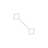 | `tool_scale` | Scale (R): corner handles + diagonal, monoline. |
|  | `tool_select` | Select (Q): monoline pointer. Studio uniform 1.6px outline. |

### Toolbar (15)

| icon | kind | purpose |
|---|---|---|
| 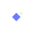 | `tb_add_state` | Diamond keyframe + small "+" tucked into the upper-right corner. |
| 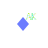 | `tb_auto_key` | Diamond keyframe + small "AK" badge in the upper-right. |
|  | `tb_loop` | Circular ↻ arrow: animation loop toggle. |
|  | `tb_new` | Blank-document: rectangle with folded upper-right corner. |
|  | `tb_open` | Folder-open: back tab + curved front flap. |
|  | `tb_play` | Right triangle ▶: playback start. |
| 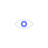 | `tb_preview` | Eye glyph: preview / inspect. |
|  | `tb_render` | Camera body + viewfinder + filled lens: final render trigger. |
|  | `tb_save` | Floppy-disk: outer square + label rectangle + corner clip. |
| 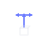 | `tb_show_manip` | T-bar gizmo glyph: vertical bar with two horizontal arrowhead caps + a small cube below to suggest "manipulator over object". |
| 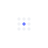 | `tb_snap_grid` | 3×3 grid of dots with the center dot highlighted accent. |
|  | `tb_soft_select` | Concentric circles fading center-to-edge (gradient falloff). |
| 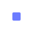 | `tb_stop` | Square ■: playback stop (Play swaps to this while running). |
| 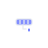 | `tb_theme` | Paint-roller: a small handle + the cylindrical roller head with three accent stripes hinting "swap palette". |
|  | `tb_undo` | ↶ rewind arrow: curved 270° arc + filled arrowhead. |

### Timeline transport (9)

| icon | kind | purpose |
|---|---|---|
|  | `tb_tl_end` | ▶▮: go to last frame. |
|  | `tb_tl_play_back` | ◀: play backwards. |
|  | `tb_tl_set_breakdown` | ◇: outlined diamond for Set Breakdown. |
|  | `tb_tl_set_key` | ◆: solid diamond for Set Key. |
|  | `tb_tl_start` | ▮◀: go to first frame. |
|  | `tb_tl_step_back` | ▮◀ small: step one frame back. |
|  | `tb_tl_step_back_key` | ◆◀: step to previous key. |
|  | `tb_tl_step_fwd` | ▶▮ small: step one frame forward. |
|  | `tb_tl_step_fwd_key` | ▶◆: step to next key. |

### Viewport / view modes (10)

| icon | kind | purpose |
|---|---|---|
| 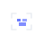 | `vp_frame_all` | Magnifier + scene brackets: Frame All. |
| 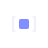 | `vp_frame_sel` | Bracket pair with a small cube inside: Frame Selected. |
|  | `vp_lighting` | Bare lightbulb. |
| 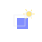 | `vp_lit` | Shaded cube + small light-bulb in the upper-right corner. |
|  | `vp_reset_camera` | 3D house-of-cards cube with a circular-arrow ring: Reset Camera / Return to 3D. The cube reads as 'a 3D scene'; the arrow reads as 'snap back / orbit reset'. |
|  | `vp_shaded` | Cube with a smoothly-shaded front face (gradient). |
|  | `vp_textured` | Cube with a 2×2 checker pattern on the front face. |
| 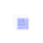 | `vp_wire_shaded` | Shaded cube with edge overlay (Alt+5). |
| 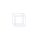 | `vp_wireframe` | Cube edges only: no fill. |
| 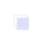 | `vp_xray` | Translucent cube: outline only, 30 % fill suggesting see-through. |
